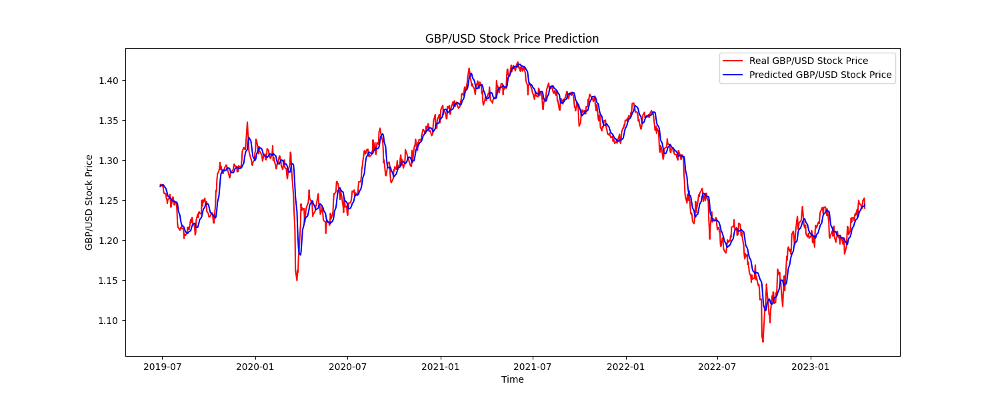

# Building a LSTM (RRN) with PyTorch to try and predict GBP/USD

This code includes a simple implementation of a Long-Short-Term Memory (LSTM) neural network for time series prediction. The code loads GBP/USD exchange rate data using the yfinance library, preprocesses the data, and uses an LSTM model to make predictions.

## Dependencies
This code requires the following libraries:

- numpy
- pandas
- matplotlib
- sklearn
- torch
- yfinance
- mplfinance

You can install these dependencies using the following command:

```
pip install numpy pandas matplotlib scikit-learn torch yfinance mplfinance
```

## Dataset


The GBP/USD exchange rate data is downloaded from Yahoo Finance using the yfinance library. The data is in the form of a Pandas dataframe and consists of the date, open price, high price, low price, closing price, adjusted closing price, and volume.

The data is pre-processed by removing unnecessary columns, filling missing values with the previous day's closing price, and scaling the closing prices with the MinMaxScaler.


## Model

The LSTM model has an input dimension of 1, hidden dimension of 16, two layers, and an output dimension of 1. The model is trained for 100 epochs with a learning rate of 0.01 using the mean squared error loss function and the Adam optimizer.


Calculated RMSE values:
- Train Score: 0.0148
- Test Score: 0.0158

## Usage

1. Run the code after installing the dependencies.

2. The code will download the GBP/USD exchange rate data using yfinance. You can change the start date of the data by modifying the start parameter in the following line of code:

```bash
df = yf.download("GBPUSD=X", start="1970-01-01")
```

3. You can also save the downloaded data to a CSV file by uncommenting the following line of code:

```arduino
# df.to_csv('GBPUSD.csv')
```

4. The code then preprocesses the data, including scaling the closing price data between -1 and 1 using MinMaxScaler. The data is split into training and test sets using the load_data function.

5. The LSTM model is defined in the LSTM class. The hyperparameters of the model can be modified by changing the values of input_dim, hidden_dim, num_layers, and output_dim.

6. The model is trained using the training data and the mean squared error (MSE) loss function. The num_epochs variable can be changed to modify the number of epochs to train the model. The training progress is stored in the hist dictionary.

7. The trained model is used to make predictions on the test data. The predictions are then compared to the actual test data using the mean_squared_error function from sklearn.

8. The predicted and actual test data are plotted using matplotlib.

